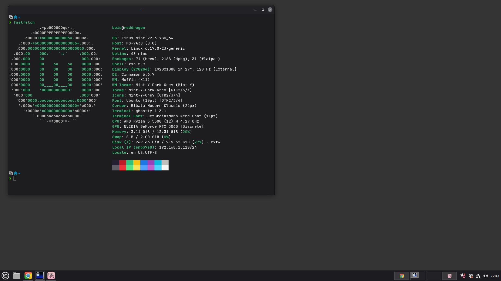

# About

A place to keep my configuration files and scripts

## FAQ (That actually no one asks)

### Q: Operating System?

- Linux Mint/LMDE for personal computers
- Debian for servers
- MacOS because of work

### Q: Why Linux Mint?

Just works. Stable. Ubuntu/Debian-based. No Snaps + Flatpak by default.
Easy to hack when wanting to.

### Q: Text Editor/IDE?

Zed, Vim, VSCode, Sublime. Why only use one when you can get
the most of them all.

### Q: Shell?

Zshell for the plugins

### Q: Terminal?

currently ghostty. but i like wezterm lua scripting

### Q: Why brew on linux?

I like having my development tools outside of the base OS installation,
accessible with a simple PATH manipulation, up-to-date and managed by
a package manager. Brew gives me all that.

### Q: Web Browser?

One that can browse the web.

### Q: Education?

BSc in Computer Engineering.

### Q: What do you do for living?

I am a computer bender.
