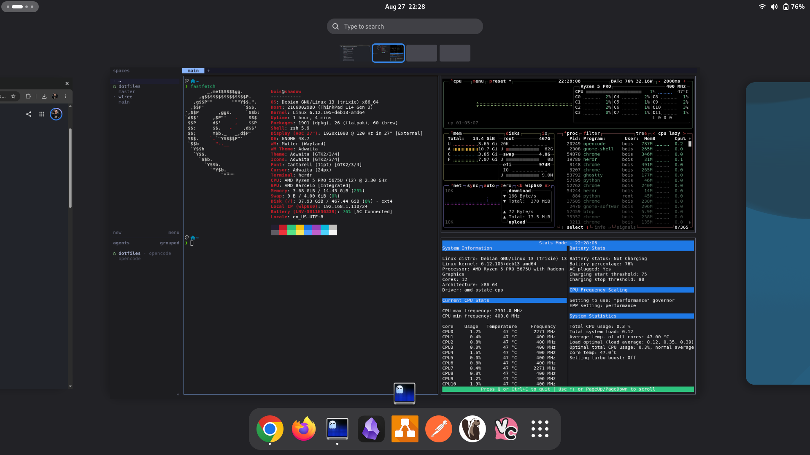

# About

A place to keep my configuration files and scripts

## FAQ (That actually no one asks)

### Q: Operating System?

- Debian for personal computers and servers
- MacOS because of work

### Q: Why Debian?

Just works. Stable. Easy to hack when wanting to.
I don't care if packages are old, I rather have them pretty stable.
Backports, brew and flatpak can do just fine for getting the software i use every day.

### Q: Text Editor/IDE?

Mostly neovim. some times VSCode for git merge conflicts and HTML

### Q: Shell?

Zshell for the plugins

### Q: Terminal?

currently ghostty, but anything decent that I can run herdr on top of can do just fine.

### Q: Why brew on linux?

I like having my development tools outside of the base OS installation,
accessible with a simple PATH manipulation, up-to-date and managed by
a package manager. Brew gives me all that.

### Q: Web Browser?

One that can browse the web.

### Q: Education?

BSc in Computer Engineering.

### Q: What do you do for living?

I am a computer bender.
