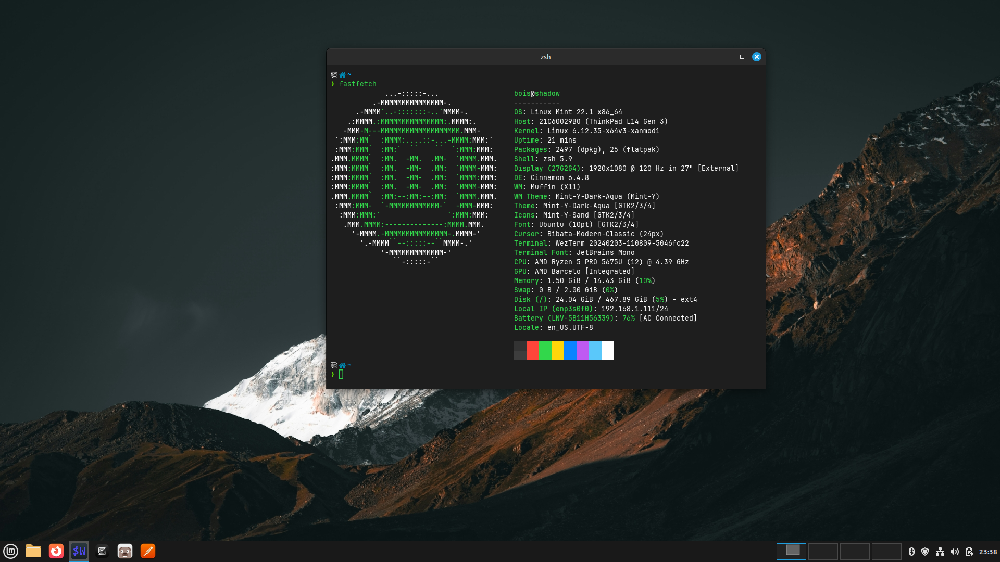

# About

A place to keep my configuration files and scripts

## My Everyday Softwares

  
Operating Systems

  - Arch Linux for laptops and desktops
  - Proxmox VE for server machines with multiple VMs
  - Debian for most server deployments
  - OPNsense for DIY routers
  - Windows VM for cursed softwares that only works in MsTM

  
Window Manager

  - i3wm

  
Web Browser

  - Firefox
  - Google Chrome

  
Terminal 

  - Alacritty

  
CLI Tools

  - Tmux
  - SSH
  - Fzf
  - Rsync
  - Netcat

  
Software development 

  - Neovim
  - Git
  - Ripgrep
  - Gdb
  - Hexdump
  - PlatformIO
  - Curl
  - Postman
  - Docker

  
Hardware development 

  - KiCAD
  - Blender
  - Saleae Logic2

  
Video Editor

  - kdenlive

  
Virtualization

  - Virt Manager
  - QEMU

  
Video/Audio Player

  - Mpv
  - VLC

  
Torrent Client

  - Transmission

  
Video recording/Streaming

  - OBS Studio

  
Gaming

  - Steam
  - Wine
  - Lutris
  - MangoHud
  - VkBasalt

  
Voice Calls/Messaging

  - Discord
  - Telegram

